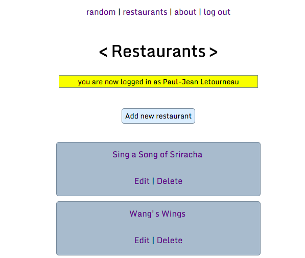
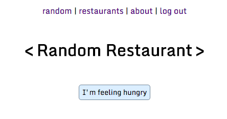

# Random Noms

## App features

Random Noms is a simple web app that allows users to log in and create and add menus for their own restaurants.
Users can then get randomly selected restaurants from the full database of restaurants added by all users.

See the full list of restaurants (and edit the list if the user is logged in):



Users can click the "I'm feeling hungry" button on the homepage:



... and get a randomly selected restaurant to eat at:


## App setup

### Required python modules

See the output of `pip freeze -l` for the required python modules (also contained in `requirements.txt`) :

```bash
vagrant@vagrant-ubuntu-trusty-32:/vagrant/random-noms$ pip freeze -l
Flask==0.9
Flask-Login==0.1.3
Markdown==2.6.2
Werkzeug==0.8.3
bleach==1.4.1
dict2xml==1.3
gunicorn==19.3.0
httplib2==0.9.1
oauth2client==1.4.11
pyasn1==0.1.7
pyasn1-modules==0.0.5
rsa==3.1.4
six==1.9.0
testresources==0.2.7
```

### Running locally

Start the app locally using `python`:

``` bash
vagrant@vagrant-ubuntu-trusty-32:/vagrant/random-noms$ python project.py
 * Running on http://0.0.0.0:5000/
 * Restarting with reloader
```

... and navigate to `localhost` port 5000.

## API endpoints

### All restaurants

#### JSON

Use the endpoint `restaurants/JSON` to get a list of restaurants in the database in JSON format:

```JSON
vagrant@vagrant-ubuntu-trusty-32:/vagrant/random-noms$ curl -L http://localhost:5000/restaurants/JSON
{
  "Restaurants": [
    {
      "name": "Samantha's Super Sammies",
      "id": 1
    }
  ]
}
```

#### XML

Use the endpoint `restaurants/XML` to get a list of restaurants in the database in XML format:

``` bash
vagrant@vagrant-ubuntu-trusty-32:/vagrant/random-noms$ curl localhost:5000/restaurants/XML/
<Restaurants>
  <restaurant>
    <id>1</id>
    <name>Samantha's Super Sammies</name>
  </restaurant>
  <restaurant>
    <id>3</id>
    <name>Other Rest</name>
  </restaurant>
  <restaurant>
    <id>6</id>
    <name>TestwoRaunt</name>
  </restaurant>
  <restaurant>
    <id>7</id>
    <name>Hello World</name>
  </restaurant>
</Restaurants>
```

### Randomly chosen restaurant

#### JSON

Use the endpoint `random_restaurant/JSON` to get a randomly chosen restaurant in JSON format:

``` bash
vagrant@vagrant-ubuntu-trusty-32:/vagrant/random-noms$ curl -L http://localhost:5000/random_restaurant/JSON
{
  "name": "Samantha's Super Sammies",
  "id": 1
}
```

#### XML

Use the endpoint `random_restaurant/XML` to get a randomly chosen restaurant in XML format:

``` bash
vagrant@vagrant-ubuntu-trusty-32:/vagrant/random-noms$ curl localhost:5000/random_restaurant/XML/
<RandomRestaurant>
  <restaurant>
    <id>7</id>
    <name>Hello World</name>
  </restaurant>
</RandomRestaurant>
```

### Menu items

#### JSON

Use the endpoint `restaurant/<rest_id>/menu/JSON` to get the menu for a given restaurant (with restaurant id `rest_id`) in JSON format:

```JSON
vagrant@vagrant-ubuntu-trusty-32:/vagrant/random-noms$ curl -L http://localhost:5000/restaurant/1/menu/JSON
{
  "MenuItems": [
    {
      "picture": "http://massystorestt.com/wp-content/uploads/2015/05/Thawa-Roti.jpg",
      "name": "Rosewater Roti",
      "price": "5.99",
      "course": "Entree",
      "id": 1,
      "description": "Roti with a hint of rosewater"
    },
    {
      "picture": "http://blogs.plos.org/obesitypanacea/files/2014/10/sandwich.jpg",
      "name": "Super Sunday Ham Sammie",
      "price": "4.99",
      "course": "Entree",
      "id": 2,
      "description": "Ham sammich (only on Sundays)"
    },
    ...
}
```

#### XML

Use the endpoint `restaurant/<rest_id>/menu/XML` to get the menu for a given restaurant (with restaurant id `rest_id`) in XML format:

``` bash
vagrant@vagrant-ubuntu-trusty-32:/vagrant/random-noms$ curl localhost:5000/restaurant/1/menu/XML/
<MenuItems>
  <menu_item>
    <course>Entree</course>
    <description>Roti with a hint of rosewater</description>
    <id>1</id>
    <name>Rosewater Roti</name>
    <picture>http://massystorestt.com/wp-content/uploads/2015/05/Thawa-Roti.jpg</picture>
    <price>5.99</price>
  </menu_item>
  <menu_item>
    <course>Entree</course>
    <description>Ham sammich (only on Sundays)</description>
    <id>2</id>
    <name>Super Sunday Ham Sammie</name>
    <picture>http://blogs.plos.org/obesitypanacea/files/2014/10/sandwich.jpg</picture>
    <price>4.99</price>
  </menu_item>
  ...
</MenuItems>
```

### Menu item

#### JSON

Use the endpoint `restaurant/<rest_id>/menu/<menu_id>/JSON` to get data for a particular menu item (with menu item id `menu_id`) in JSON format:

```JSON
vagrant@vagrant-ubuntu-trusty-32:/vagrant/random-noms$ curl -L http://localhost:5000/restaurant/1/menu/5/JSON
{
  "MenuItem": {
    "picture": "http://www.thedeliciouslife.com/wp-content/uploads/2010/11/salts-cure-pickle-plate.jpg",
    "name": "Pre-sandwich pickle plate",
    "price": "3.99",
    "course": "Appetizer",
    "id": 5,
    "description": "Brine Pickles of many varieties"
  }
}
```

#### XML

Use the endpoint `restaurant/<rest_id>/menu/<menu_id>/XML` to get data for a particular menu item (with menu item id `menu_id`) in XML format:

``` bash
vagrant@vagrant-ubuntu-trusty-32:/vagrant/random-noms$ curl localhost:5000/restaurant/1/menu/5/XML/
<MenuItem>
  <menu_item>
    <course>Appetizer</course>
    <description>Brine Pickles of many varieties</description>
    <id>5</id>
    <name>Pre-sandwich pickle plate</name>
    <picture>http://www.thedeliciouslife.com/wp-content/uploads/2010/11/salts-cure-pickle-plate.jpg</picture>
    <price>3.99</price>
  </menu_item>
</MenuItem>
```

## Social sign-on

The app allows the user to log in via Google+ and Facebook social sign-on buttons:


### Google+

The Google+ social sign-on _hybrid auth flow_ proceeds in several token exchanges:

* user clicks the G+ sign-in button
* app server validates the `state token` on the page
(ensuring the page was generated by the app server, guarding against cross-site scripting attacks)
* client is redirected to the G+ sign-in portal, where user authorizes the app (using G+ JS client API)
* G+ server sends a `one-time code` back to the client
* client forwards the `one-time code` to the app server
* app server relays the `one-time code` _back_ to the G+ API server (via G+ [OAuth v2](https://accounts.google.com/o/oauth2/auth) callback URL)
* G+ API verifies the `one-time code` has made a round-trip via the app server, and replies with a long-lived `access token`
* app server uses the long-lived `access token` to make further G+ API calls on behalf of the user

The G+ sign-on requires a file called `client_secrets.json` to authenticate the app with the G+ API server,
which can be downloaded from the [Google developer site](https://console.developers.google.com).

### Facebook

The Facebook social sign-on auth flow proceeds much the same as for G+, with a short-lived access code
provided by the FB API going round-trip through the app server, and upgraded to a long-lived
access token via the FB OAuth v2 API server.

The FB sign-on requires a file called `fb_client_secrets.json` to authenticate the app with the FB API server.
The file needs to contain an `app_id` and `app_secret`, which can be obtained [Facebook developer site](https://developers.facebook.com/apps),
in the following format:

``` javascript
{
    "web": {
        "app_id": "XXXXXXX",
        "app_secret": "XXXXXX"
    }
}
```
